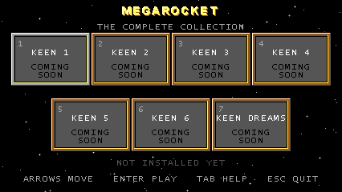

# MEGAROCKET

**All seven Commander Keen games, playable from the couch on a modern
display** — 16:9 widescreen, high-refresh smooth motion, quicksave, full
controller support and rebinding, crisp pixels always — and still
**simulation-identical to DOS**, proven by replaying recorded input
against per-frame state checksums.



Megarocket contains **no game data whatsoever**. It plays *your* copies
of the games: every byte of id Software's data — graphics, levels,
sounds, even the data tables embedded inside the original executables —
is read or reconstructed from the files you supply, on your machine, at
first run.

## Playing (testers start here)

1. Download the latest `Megarocket-*.zip` from
   [Releases](../../releases), and unzip it anywhere.
2. Copy each game's original files into its folder — every game folder
   contains a `PUT ... FILES HERE.txt` saying exactly what goes where,
   and `README.txt` has the full table. The Steam releases work great.
3. Run `Start Megarocket.bat`. Slots light up READY as their files are
   found; first launch renders title art and (if you have Keen 4/5)
   the Galaxy audio for Keen 1-3, then you're set for good.

## Features

- **Keen 1–3** (MSVC port of K1n9_Duk3's GPL source reconstruction):
  widescreen up to 16:9, interpolated smooth scrolling, quicksave/load,
  full keyboard + gamepad rebinding, persistent score box, edge pop-in
  ghost fix — and optional **Galaxy sfx / Galaxy tunes** toggles that
  play Keen 4/5's AdLib sounds and music, rendered from your own data.
  Engine data tables are ripped from your `KEEN?.EXE` at every boot
  (LZEXE unpacked in memory), so the shipped binaries are data-free.
- **Keen 4–6** (Omnispeak fork): widescreen compositor with entity
  interpolation, smooth scrolling, dialog centering, pinned score box,
  ghost sprites, native settings menus, Keen 6 v1.0 support.
- **Keen Dreams** (ReflectionHLE fork): widescreen compositor,
  interpolation, quicksave, gamepad rebinding (F6), framed backdrop.
- **The launcher**: controller-first, big beveled UI, auto-pulled title
  art from your own game files, How-To and About pages.

Every gameplay-affecting change is gated by replay verification: the
games record per-frame checksums of complete simulation state, and each
engine build must replay its baselines bit-identically before it ships.

## Building from source

Windows, Visual Studio 2022 Build Tools (MSVC + bundled CMake).

```
git clone https://github.com/CrossplayGaming/megarocket
cd megarocket
git clone https://github.com/CrossplayGaming/omnispeak
git clone https://github.com/CrossplayGaming/ReflectionHLE refkeen
cd refkeen && git checkout keenlauncher && cd ..
cd omnispeak && git checkout megarocket && cd ..
```

Unpack SDL2 (2.32.x, VC devel) and SDL3 (3.2.x, VC devel) into
`deps\SDL2-<ver>` and `deps\SDL3-<ver>`, configure each project's
`build\` directory with CMake (`-A x64`, pass `-DSDL2_DIR=` where
needed), then:

```
powershell -File build_megarocket.ps1
```

produces the clean distributable at `dist\Megarocket` and audits it for
game-data leaks.

## Repository layout

- `launcher/` — the Megarocket shell (C + SDL2)
- `keen13/` — Keen 1-3: `reconstruction/` (K1n9_Duk3's GPL source),
  `port/` (the modern engine layer), `tools/`, `verify/` (replay gates)
- `verify/`, `keendreams/verify/` — replay gates for Keen 4-6 / Dreams
- `dist-src/`, `build_megarocket.ps1` — the distribution recompiler
- Engine forks (separate repos, cloned in):
  [omnispeak](https://github.com/CrossplayGaming/omnispeak) (branch
  `megarocket`),
  [refkeen](https://github.com/CrossplayGaming/ReflectionHLE) (branch
  `keenlauncher`)

## Credits and license

Standing on giants: [K1n9_Duk3's Keen 1-3 source
reconstruction](https://k1n9duk3.shikadi.net),
[Omnispeak](https://github.com/sulix/omnispeak) by David Gow and
contributors, [ReflectionHLE](https://github.com/NY00123/refkeen) by
NY00123, and DBOPL from the DOSBox project.

All code is **GPL v2 or later** (see [LICENSE](LICENSE)). Commander
Keen is a trademark of its owners; this is an unaffiliated fan project
that includes none of their data.
